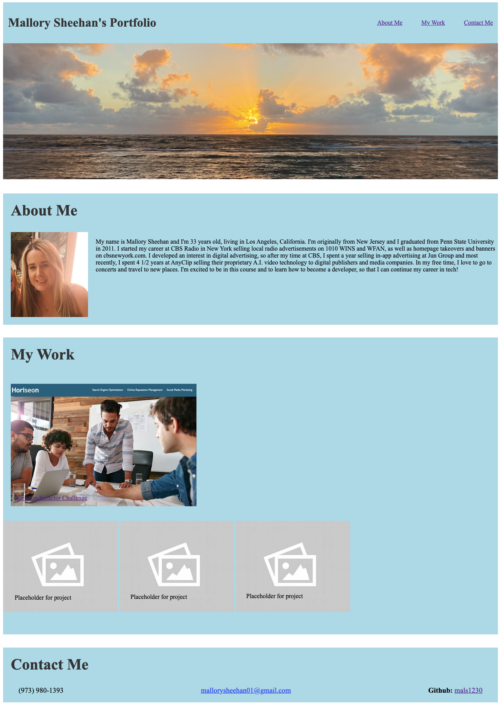

# mallory-sheehan-portfolio

## This is my first attempt at a portfolio!
I've included my name and 3 different sections about myself - an 'About Me' section outlining my professional history, a 'My Work' section showing the 1 challenge that I've completed and I left room to add a few more projects once I've completed them, and finally there is a 'Contact Me' section. 

I had some challenges with this assignment - mainly with flex box and making sure that the page will be responsive to all screens. 

But I also overcame a few challenges, for example, I figured out how to link and image to redirect you to a site. In this came, I linked the screenshot of the horiseon-refactor project to my live site! 

Screenshot of deployed site: 

URL of deploted site: 
https://mals1230.github.io/mallory-sheehan-portfolio/

GitHub repo: 
https://github.com/mals1230/mallory-sheehan-portfolio
